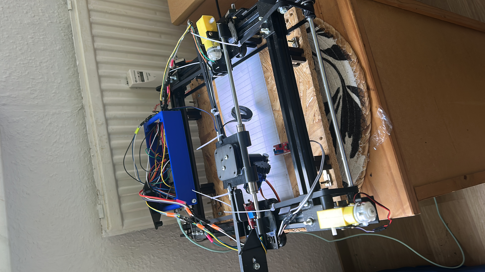
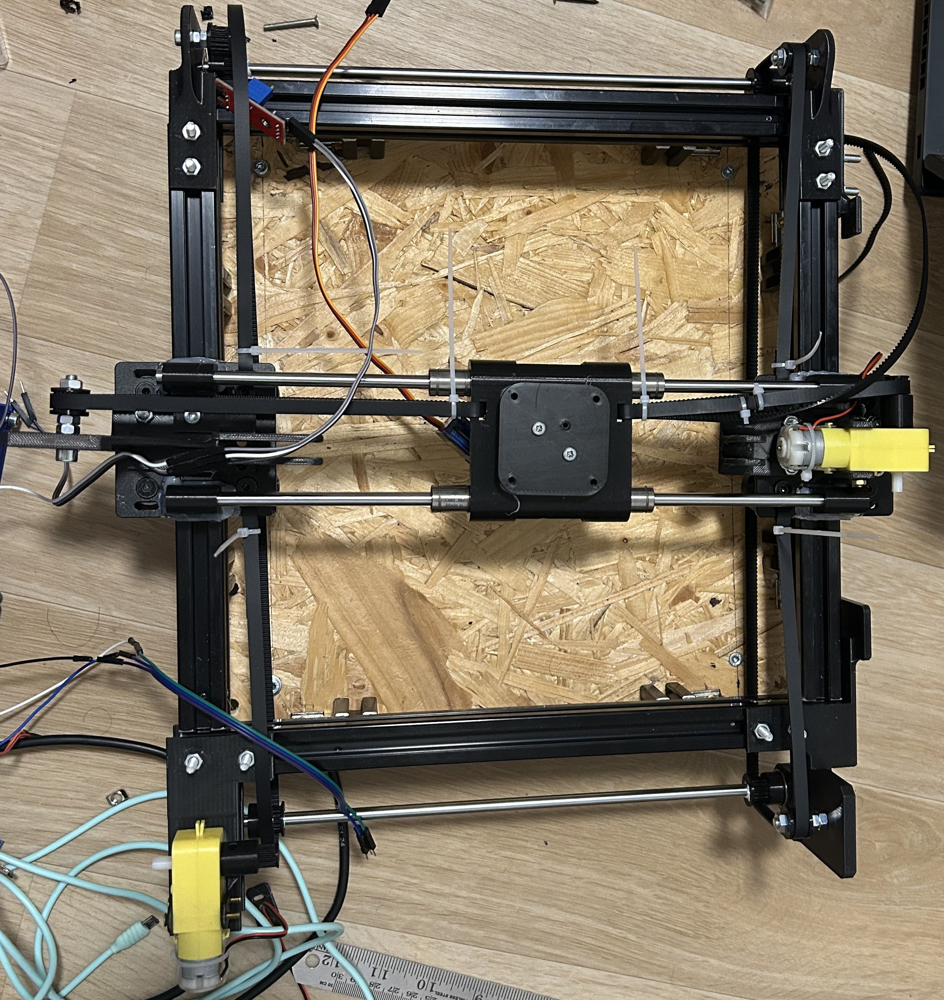
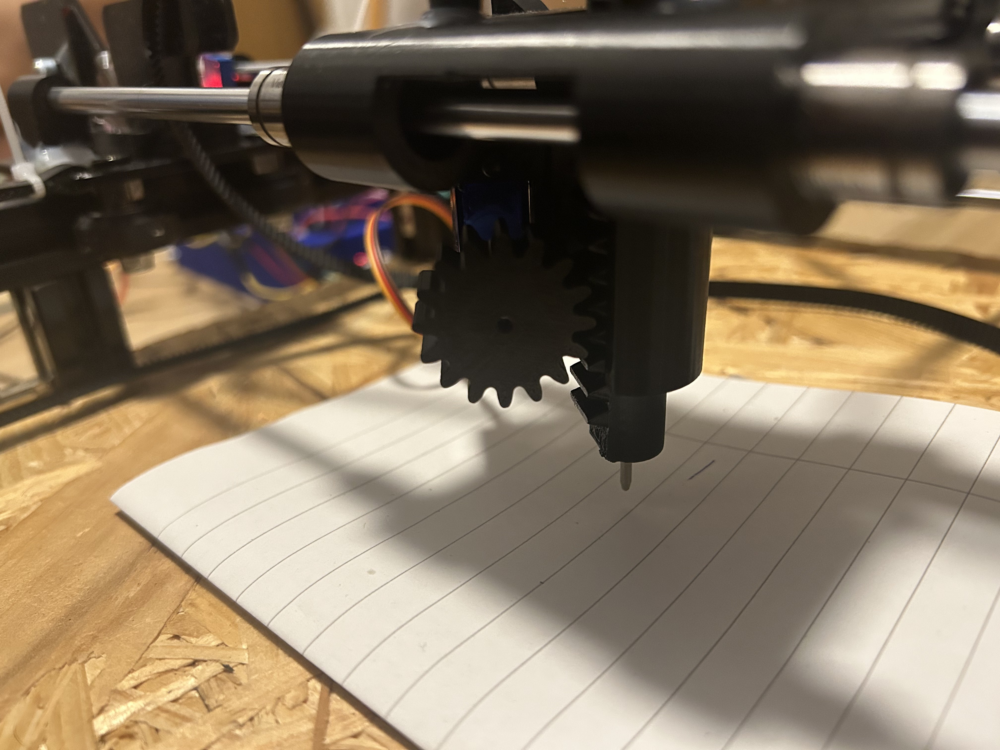
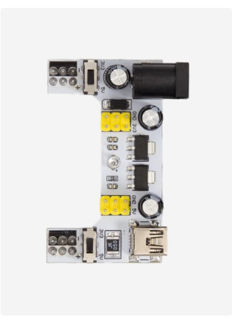
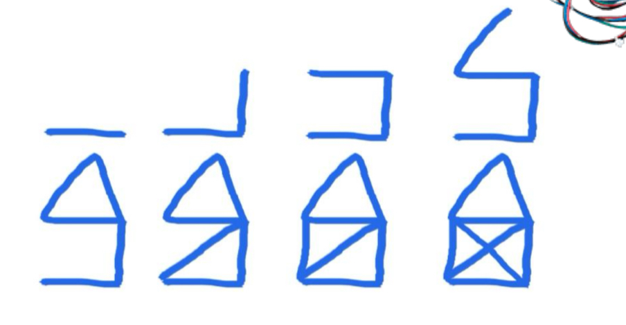
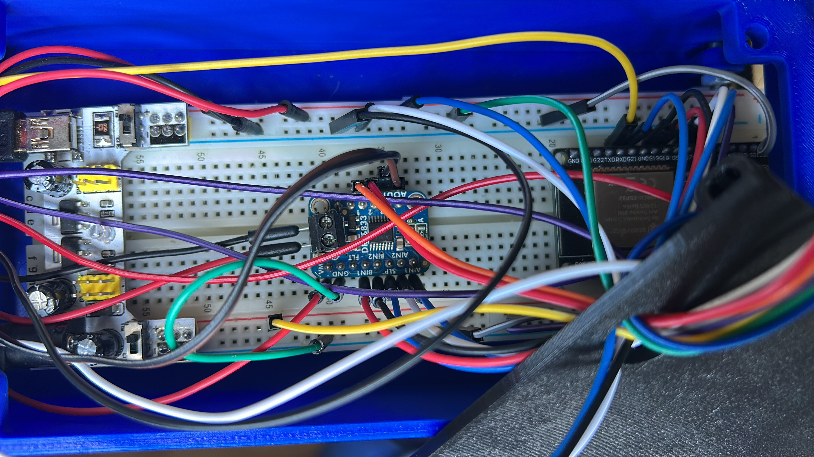

# Automated Pen Plotter (ESP32)

A 3-axis mechatronic drawing system built as a **team project**: 2 stepper motors drive the X/Y plotting axes, and a servo motor handles pen lift/retraction. Built and tuned June–July 2025.

## Overview

The plotter takes X/Y motion commands and reproduces line drawings on paper, with the servo lifting the pen between strokes to avoid drag marks. The system was assembled from a mix of off-the-shelf drivers/motors and custom-designed and 3D-printed structural parts, controlled via an ESP32 and a browser-based control interface.

## Team & Contributions

This was a team build. In the interest of accurate attribution:

- **Mechanical design (my contribution):** SolidWorks part modeling and structural design of the frame/carriage components, prepared for 3D printing.
- **Web control interface (my contribution):** HTML/CSS front-end for sending plot commands to the system.
- **Firmware (shared):** Partial contribution to the Arduino motor/homing logic.
- **Driver & sensor stack (shared):** DRV8833 motor driver integration, TT-motor setup, Hall-sensor and limit-switch homing logic, and OTA firmware update capability

## Hardware

- ESP32 microcontroller
- 2x stepper motors (X/Y gantry)
- 1x servo motor (pen lift/retraction)
- TT motors with Hall-effect sensors and limit switches for homing (teammate's subsystem)
- DRV8833 motor driver (teammate's subsystem)
- Buck converter / power distribution module (pictured below)
- 3D-printed structural parts (SolidWorks-designed)

## Photos

| | |
|---|---|
|  | Full assembled plotter frame with wiring harness |
|  | Top-down view of the gantry frame during assembly |
|  | Close-up of the pen-lift gear/servo mechanism above test paper |
|  | Buck converter / power distribution module used in the build |
|  | Character test drawing produced during calibration |
|  | Breadboard wiring: DRV8833 motor driver, buck converter, and ESP32 |

## Notes

Built as directional exposure to mechatronic system integration — mechanical design, firmware, and a simple web control layer working together on real hardware. 
